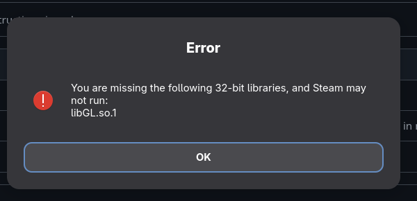

# Instruction

"Error message when start Steam"

1.  Rigth-Click on libGL.so.1.7.0 file on this page and Choose " Save Link as...". 
And save it to Downloads folder.

2. Open terminal let go to download folder by typing:
     > cd ~/Downloads

3. Then to rename old libGL file. Open terminal and type command:

   >  sudo mv /usr/lib/libGL.so.1.1.7 /usr/lib/libGL.so.1.7.0.old

4. Then copy our new file into /usr/lib folder to subtitute file by typing:

     > sudo cp libGL.so.1.7.0 /usr/lib/

5. Make sure it is copied and run Steam. Now it should start without error message.

